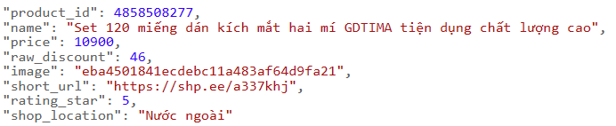

# Coupon-scraping

## Hướng dẫn sử dụng API

- `/`: "Hello world"
- `/login` (POST), body (username: string, password: string)
    - Nếu xảy ra lỗi hệ thống ở server: 505 (Internal server error)
    - Nếu không username hoặc password không trùng: 401 (Invalid username or password)
    - Nếu thành công: trả về token
- `/signup` (POST), body (username: string, password: string)
    - Nếu xảy ra lỗi hệ thống ở server: 505 (Internal server error)
    - Nếu username đã tồn tại: 409 (Username already taken)
    - Nếu tạo thành công: 201 (User created)
- `/shopee` (GET)
    - Nếu xảy ra lỗi hệ thống ở server: 505 (Internal server error)
    - Nếu GET thành công:
    
    